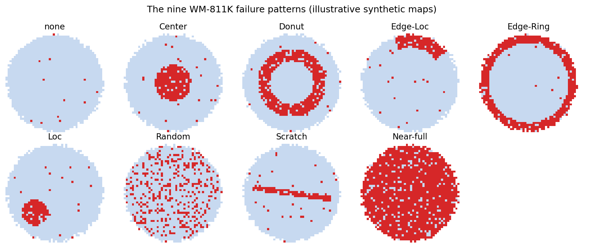

Automated **9-class silicon-wafer defect classification with Grad-CAM spatial
localisation**, trained on the real-fab [WM-811K / LSWMD](https://www.kaggle.com/datasets/qingyi/wm811k-wafer-map)
dataset (811,457 wafer maps; 172,950 expert-labelled). Built to handle the
extreme class imbalance that makes raw accuracy meaningless in a fab: **~85% of
labelled wafers have no defect.**

## Live demo

https://waferdefect-ia2alfcoxwu4wjvuxcqkl4.streamlit.app/

| | |
|-|-|
| **Task** | 9-class wafer-map failure-pattern classification |
| **Data** | WM-811K / LSWMD (Kaggle), 172,950 labelled maps |
| **Classes** | `none`, `Center`, `Donut`, `Edge-Loc`, `Edge-Ring`, `Loc`, `Random`, `Scratch`, `Near-full` |
| **Model** | 2-channel CNN (die-exists / die-failed masks), macro-F1-selected |
| **Explainability** | Grad-CAM heatmaps over the wafer map |
| **Baselines** | Random Forest on handcrafted features; small CNN on the raw map |
| **Key challenge** | severe imbalance (`none` ≈ 85%, `Near-full` < 0.1%) |

## Results

| Metric | Score |
|-|-|
| Macro-F1 | **0.77** |
| Balanced accuracy | 0.85 |
| Raw accuracy | 0.95 |

Per class:

| Class | Precision | Recall | F1 | Support |
|-|-|-|-|-|
| none | 0.99 | 0.97 | 0.98 | 22100 |
| Center | 0.85 | 0.92 | 0.88 | 698 |
| Donut | 0.67 | 0.99 | 0.80 | 102 |
| Edge-Loc | 0.65 | 0.79 | 0.71 | 728 |
| Edge-Ring | 0.97 | 0.97 | 0.97 | 1337 |
| Loc | 0.71 | 0.50 | 0.59 | 548 |
| Random | 0.86 | 0.96 | 0.91 | 125 |
| Scratch | 0.18 | 0.57 | 0.27 | 162 |
| Near-full | 0.72 | 0.96 | 0.82 | 24 |

## Methodology notes

* **Split by lot, not randomly.** Wafers from the same `lotName` share a process
  run; a random split leaks lot-specific signal into the test set and inflates
  apparent accuracy. This project splits by lot (`GroupShuffleSplit` on
  `lotName`).
* **Nearest-neighbor resize.** Maps vary in shape (die count varies by product);
  all are resized to 64×64 with **nearest-neighbor** interpolation to preserve
  the discrete `{background, pass, fail}` semantics — bilinear/bicubic would blur
  categories into meaningless in-between values.
* **Two-channel categorical encoding.** Each map is fed as two binary channels
  (*die exists*, *die failed*) rather than one ordinal `{0, .5, 1}` channel, so
  the network is never told a passing die sits "halfway between" background and a
  failed die — they are categories, not a scale.
* **Imbalance handling.** `none` ≈ 85%; the rarest class (`Near-full`) is < 0.1%.
  Both baselines use class-weighted loss (focal loss is also available), and
  **checkpoint selection and reporting use macro-F1**, not raw accuracy, which
  swings 15+ points epoch-to-epoch on this data while saying nothing about the
  minority patterns.
* **Nested label fields.** `LSWMD.pkl` stores `failureType` / `trainTestLabel`
  as 1-element nested arrays (a MATLAB-struct leftover); `data_loader.py` unwraps
  them and drops unlabelled wafers for supervised training.
* **Training stability.** Adam with `ReduceLROnPlateau` (halve LR on val-macro-F1
  plateau) and early stopping on val macro-F1, fixed seed for reproducibility.

## Roadmap

* Push `Scratch` precision up (focal loss sweep, targeted augmentation, a
  Scratch-vs-Loc/Edge-Loc sub-head).
* A deeper backbone (e.g. a 2-channel ResNet) as a drop-in alternative to the
  small CNN, compared honestly against it.
* Calibrated confidence + an abstain/"route to human" threshold for low-confidence
  wafers, the fab-realistic way to use a classifier that isn't perfect on the tail.

## Dataset citation

M.-J. Wu, J.-S. R. Jang, and J.-L. Chen, "Wafer Map Failure Pattern Recognition
and Similarity Ranking for Large-Scale Data Sets," *IEEE Transactions on
Semiconductor Manufacturing*, 2015. Dataset on
[Kaggle](https://www.kaggle.com/datasets/qingyi/wm811k-wafer-map) and
[MIR Lab](http://mirlab.org/dataset/public/).

## License

MIT (this code). The dataset has its own Kaggle license — check the dataset page
before redistributing it.

