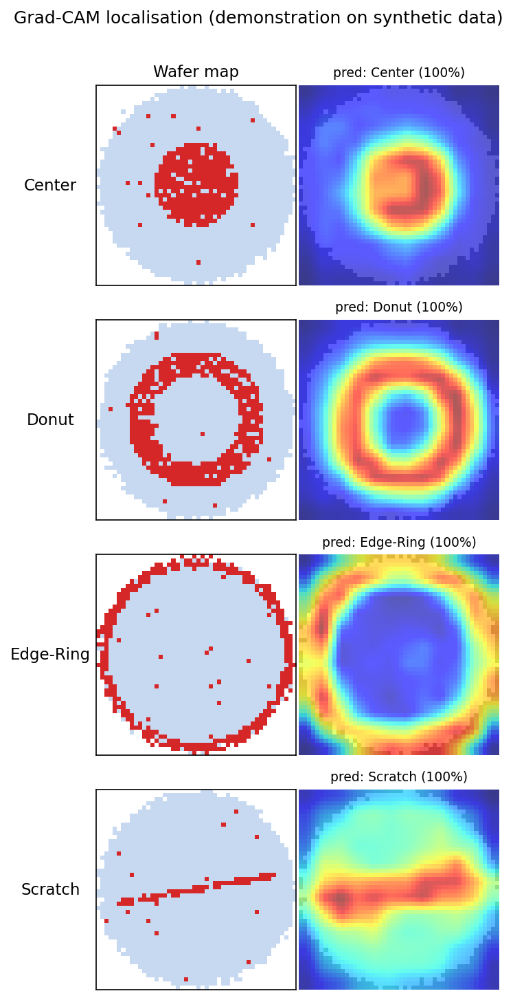

# 🔬 Wafer-Defect Metrology — Deep-Learning Bin-Map Inspection

[](https://github.com/Neeraj-N/Wafer_Defect/actions/workflows/ci.yml)
[](https://www.python.org/)
[](https://pytorch.org/)
[](LICENSE)
<!-- After deploying the demo (docs/DEPLOY_HF_SPACES.md), replace the line below with your Space URL:
[](https://huggingface.co/spaces/<you>/wafer-defect-metrology) -->
[](docs/DEPLOY_HF_SPACES.md)

Automated **9-class silicon-wafer defect classification with Grad-CAM spatial
localisation**, trained on the real-fab [WM-811K / LSWMD](https://www.kaggle.com/datasets/qingyi/wm811k-wafer-map)
dataset (811,457 wafer maps; 172,950 expert-labelled). Built to handle the
extreme class imbalance that makes raw accuracy meaningless in a fab: **~85% of
labelled wafers have no defect.**


| | |
|-|-|
| **Task** | 9-class wafer-map failure-pattern classification |
| **Data** | WM-811K / LSWMD (Kaggle), 172,950 labelled maps |
| **Classes** | `none`, `Center`, `Donut`, `Edge-Loc`, `Edge-Ring`, `Loc`, `Random`, `Scratch`, `Near-full` |
| **Model** | 2-channel CNN (die-exists / die-failed masks), macro-F1-selected |
| **Explainability** | Grad-CAM heatmaps over the wafer map |
| **Baselines** | Random Forest on handcrafted features; small CNN on the raw map |
| **Key challenge** | severe imbalance (`none` ≈ 85%, `Near-full` < 0.1%) |

## 📊 Results

CNN on the held-out **test** split (lot-grouped; nine classes including `none`
and `Near-full`). Regenerate any time with
`python -m src.evaluate --checkpoint checkpoints/best_cnn.pt --benchmark-latency --markdown docs/metrics.md`.

| Metric | Score |
|-|-|
| Macro-F1 | **0.77** |
| Balanced accuracy | 0.85 |
| Raw accuracy | 0.95 |
| Cost-weighted error | run `--benchmark-latency`/evaluate to fill in |
| Inference latency | run `evaluate --benchmark-latency` on your hardware |

> Latency and cost-weighted error are **measured on your machine**, not quoted
> here — a portfolio README shouldn't hard-code a millisecond number a reviewer
> can't reproduce. `src/evaluate.py --benchmark-latency` prints both.

Per class:

| Class | Precision | Recall | F1 | Support |
|-|-|-|-|-|
| none | 0.99 | 0.97 | 0.98 | 22100 |
| Center | 0.85 | 0.92 | 0.88 | 698 |
| Donut | 0.67 | 0.99 | 0.80 | 102 |
| Edge-Loc | 0.65 | 0.79 | 0.71 | 728 |
| Edge-Ring | 0.97 | 0.97 | 0.97 | 1337 |
| Loc | 0.71 | 0.50 | 0.59 | 548 |
| Random | 0.86 | 0.96 | 0.91 | 125 |
| Scratch | 0.18 | 0.57 | 0.27 | 162 |
| Near-full | 0.72 | 0.96 | 0.82 | 24 |

`Scratch` is the honest hard case — thin, sparse, easily confused with `Loc`
and `Edge-Loc`. Improving its precision is the most useful next experiment
(see [Roadmap](#-roadmap)).

## 🖼️ Explainability (Grad-CAM)

Metrology engineers care *where* on the wafer a prediction comes from — a
`Scratch` or `Edge-Ring` call should be driven by the failed dies in that
pattern, not by background noise. `src/gradcam.py` implements Grad-CAM from
scratch (no extra dependency) over the last conv block.



> The figure above is a **demonstration on synthetic wafer maps** (so it runs
> without the 3.5 GB dataset) — the heatmaps land squarely on each pattern,
> confirming the pipeline. To produce Grad-CAM on **real WM-811K wafers** with
> your trained checkpoint:
>
> ```bash
> python -m src.gradcam --checkpoint checkpoints/best_cnn.pt \
>     --classes Scratch Donut Edge-Loc Center --out docs/images
> ```
>
> Regenerate the demo figures with `python docs/make_figures.py`.

## 🚀 Live demo

An interactive [Streamlit](https://streamlit.io/) app (`app.py`): pick or upload
a wafer map, get the predicted class, per-class probabilities, and the Grad-CAM
overlay — no local Python needed once it's on a Space.

```bash
pip install -r requirements.txt -r requirements-app.txt
streamlit run app.py
```

Deploy free on Hugging Face Spaces in a few minutes:
**[docs/DEPLOY_HF_SPACES.md](docs/DEPLOY_HF_SPACES.md)**. The app auto-loads
`checkpoints/best_cnn.pt`; with no checkpoint it runs in a clearly-labelled demo
mode (untrained model — the UI works, the probabilities are meaningless).

## ⚙️ Setup

```bash
python -m venv .venv && source .venv/bin/activate
pip install -r requirements.txt
```

## 📥 Getting the data

You need a (free) Kaggle account and API token.

1. On kaggle.com: **Account → Create New API Token** → downloads `kaggle.json`
2. `mkdir -p ~/.kaggle && mv kaggle.json ~/.kaggle/ && chmod 600 ~/.kaggle/kaggle.json`
3. `bash scripts/download_data.sh`  (downloads `LSWMD.pkl`, ~3.5 GB unpacked, into `data/raw/`)

Alternative: `pip install kagglehub` then
`kagglehub.dataset_download("qingyi/wm811k-wafer-map")`.

## 🧑‍💻 Usage

```bash
# 1. Explore
jupyter notebook notebooks/01_eda.ipynb

# 2. Random Forest baseline (fast sanity check)
python -m src.train_baseline

# 3. Train the CNN (40 = upper bound; early stopping usually halts sooner)
python -m src.train --epochs 40 --batch-size 128 --img-size 64
#    …or try focal loss for the rare defect tail:
python -m src.train --loss focal --focal-gamma 2.0

# 4. Evaluate on the held-out test split (+ latency, + Markdown report)
python -m src.evaluate --checkpoint checkpoints/best_cnn.pt \
    --benchmark-latency --markdown docs/metrics.md

# 5. Grad-CAM figures on real wafers
python -m src.gradcam --checkpoint checkpoints/best_cnn.pt --out docs/images
```

## 🗂️ Repo structure

```
wafer-defect-classification/
├── app.py                  # Streamlit demo (predict + Grad-CAM)
├── data/{raw,processed}/   # LSWMD.pkl + cached arrays (gitignored)
├── docs/
│   ├── make_figures.py     # regenerate README figures
│   ├── DEPLOY_HF_SPACES.md # one-click demo hosting
│   └── images/             # taxonomy + Grad-CAM figures
├── notebooks/01_eda.ipynb  # class distribution, sample maps, size variability
├── src/
│   ├── config.py           # paths & hyperparameters
│   ├── data_loader.py      # load LSWMD.pkl, unwrap labels, filter labelled
│   ├── preprocessing.py    # resize maps, lot-grouped train/val/test split
│   ├── features.py         # handcrafted features (density grid + Radon)
│   ├── dataset.py          # PyTorch Dataset (2 binary channels)
│   ├── model.py            # small CNN
│   ├── losses.py           # focal loss option
│   ├── train.py            # CNN training loop (CLI)
│   ├── train_baseline.py   # Random Forest baseline (CLI)
│   ├── evaluate.py         # macro-F1, per-class, cost & latency (CLI)
│   ├── metrics.py          # per-class / cost-weighted / latency helpers
│   ├── gradcam.py          # Grad-CAM (CLI + library)
│   ├── inference.py        # UI-agnostic predict / predict+CAM
│   ├── synthetic.py        # illustrative maps (figures, demo, tests)
│   └── visualize.py        # plotting helpers
├── scripts/download_data.sh
└── tests/                  # unit tests (no dataset required)
```

## 🔬 Methodology notes

* **Split by lot, not randomly.** Wafers from the same `lotName` share a process
  run; a random split leaks lot-specific signal into the test set and inflates
  apparent accuracy. This project splits by lot (`GroupShuffleSplit` on
  `lotName`).
* **Nearest-neighbor resize.** Maps vary in shape (die count varies by product);
  all are resized to 64×64 with **nearest-neighbor** interpolation to preserve
  the discrete `{background, pass, fail}` semantics — bilinear/bicubic would blur
  categories into meaningless in-between values.
* **Two-channel categorical encoding.** Each map is fed as two binary channels
  (*die exists*, *die failed*) rather than one ordinal `{0, .5, 1}` channel, so
  the network is never told a passing die sits "halfway between" background and a
  failed die — they are categories, not a scale.
* **Imbalance handling.** `none` ≈ 85%; the rarest class (`Near-full`) is < 0.1%.
  Both baselines use class-weighted loss (focal loss is also available), and
  **checkpoint selection and reporting use macro-F1**, not raw accuracy, which
  swings 15+ points epoch-to-epoch on this data while saying nothing about the
  minority patterns.
* **Nested label fields.** `LSWMD.pkl` stores `failureType` / `trainTestLabel`
  as 1-element nested arrays (a MATLAB-struct leftover); `data_loader.py` unwraps
  them and drops unlabelled wafers for supervised training.
* **Training stability.** Adam with `ReduceLROnPlateau` (halve LR on val-macro-F1
  plateau) and early stopping on val macro-F1, fixed seed for reproducibility.

## 🧭 Roadmap

* Push `Scratch` precision up (focal loss sweep, targeted augmentation, a
  Scratch-vs-Loc/Edge-Loc sub-head).
* A deeper backbone (e.g. a 2-channel ResNet) as a drop-in alternative to the
  small CNN, compared honestly against it.
* Calibrated confidence + an abstain/"route to human" threshold for low-confidence
  wafers — the fab-realistic way to use a classifier that isn't perfect on the tail.

<!--
## 🔗 Cross-domain note (optional — fill in or delete)
If you want the "biomedical → semiconductor" narrative bridge, add it HERE in
your own words, describing YOUR pathology-slide project. Example skeleton:
"This reuses the multi-resolution spatial-feature approach from my <N>-stage
whole-slide pathology pipeline (<link>): <one concrete technique you carried
over>." Left commented out because it should be true and specific to your work,
not boilerplate.
-->

## 📖 Dataset citation

M.-J. Wu, J.-S. R. Jang, and J.-L. Chen, "Wafer Map Failure Pattern Recognition
and Similarity Ranking for Large-Scale Data Sets," *IEEE Transactions on
Semiconductor Manufacturing*, 2015. Dataset on
[Kaggle](https://www.kaggle.com/datasets/qingyi/wm811k-wafer-map) and
[MIR Lab](http://mirlab.org/dataset/public/).

## 📝 License

MIT (this code). The dataset has its own Kaggle license — check the dataset page
before redistributing it.

